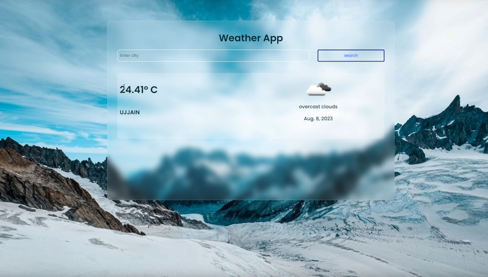

# Live Weather Prediction App

This is a web application built with Django framework that provides live weather predictions using an external weather API.

## Features

- **Live Weather Data**: The app fetches live weather data from an external weather API.
- **Location-Based Forecasts**: Users can get weather forecasts for their current location or search for forecasts of other locations.
- **Interactive UI**: The app provides an interactive user interface to view weather information in a user-friendly manner.
- **Customizable Settings**: Users can customize settings such as temperature units (e.g., Celsius, Fahrenheit), language, etc.
- **Historical Data**: The app may also offer historical weather data, depending on the capabilities of the weather API.

## Technologies Used

- **Django Framework**: Used to build the backend server and manage the application logic.
- **Python**: Programming language used for backend development.
- **HTML/CSS/JavaScript**: Frontend technologies used for building the user interface.
- **Bootstrap**: Frontend framework for responsive and mobile-first design.
- **External Weather API**: Used to fetch live weather data.

## Installation

1. Clone the repository:

git clone https://github.com/your_username/live-weather-prediction-app.git

2. Navigate to the project directory:
   cd live-weather-prediction-app
   
4. Run migrations:
   python manage.py migrate
   
6. Start the development server:
    python manage.py runserver
  
6. Access the application in your web browser at `http://localhost:8000`.

## Configuration

1. Obtain API key: Sign up for an account on an external weather API service and obtain an API key.
2. Configure settings: Add the API key to your Django settings file (`settings.py`) under a secure and hidden environment variable.

## Usage

1. Home Page: The home page displays the current weather information for the user's location (if available) or a default location.
2. Search: Users can search for weather forecasts of specific locations using the search bar.
3. Settings: Users can customize settings such as temperature units, language, etc.
4. Refresh: Users can manually refresh weather data or set up auto-refresh options.

## Contributing

Contributions are welcome! Please feel free to fork the repository, make changes, and submit a pull request.

## Acknowledgements

- **Django Documentation**: Official documentation for Django framework.
- **External Weather API Documentation**: Documentation provided by the weather API service.
- **Bootstrap Documentation**: Official documentation for Bootstrap framework.

   